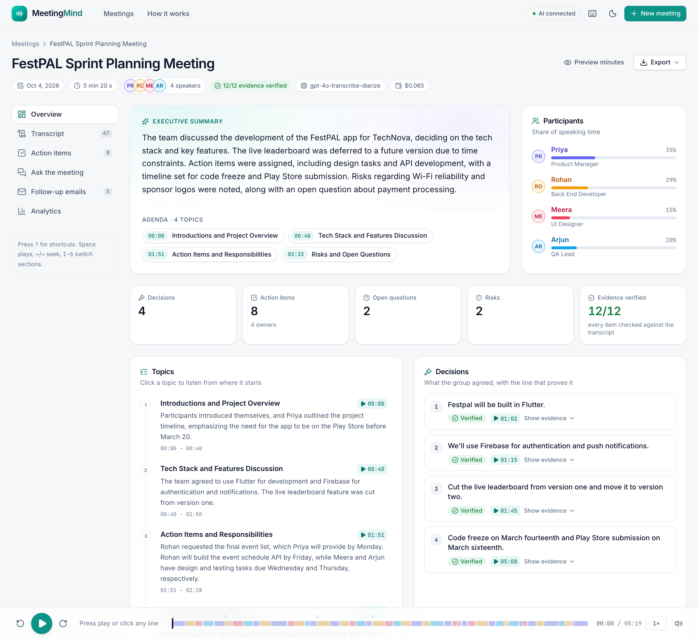
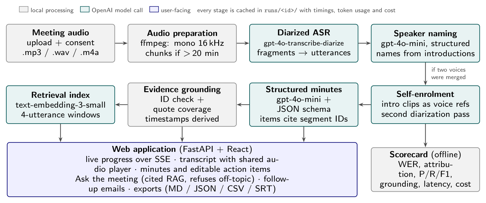

# MeetingMind

MeetingMind is an end-to-end Generative AI application that takes a meeting recording and produces:

1. a **speaker-diarized transcript**, with speakers named from their own introductions;
2. **evidence-grounded minutes and action items**, where every decision and task is checked against the transcript;
3. **per-owner follow-up emails** and a team recap;
4. **"Ask the Meeting"**, retrieval-augmented Q&A that cites `[mm:ss]` timestamps and refuses off-topic questions;
5. **exports** (Markdown, JSON, CSV, SRT);
6. an **evaluation scorecard** computed algorithmically against a gold script. No LLM is used as a judge.

> Generative AI Laboratory, Experiment 8: Mini Project, Design of an End-to-End Generative AI Application.
>
> **Read more:** [IEEE-style report (PDF)](docs/MeetingMind_IEEE_Report.pdf) · [Project explanation (PDF)](docs/MeetingMind_Project_Explanation.pdf)



## Architecture



```
audio (.mp3/.wav/.m4a)
  -> audio_prep      ffprobe + ffmpeg -> mono 16 kHz 64 kbps mp3, 25 MB guard, split only if > 20 min
  -> stt (pass 1)    gpt-4o-transcribe-diarize, diarized_json, chunking_strategy="auto"
                     phrase fragments merged into utterances S1..Sn; whisper-1 fallback (no speakers)
  -> speaker_naming  gpt-4o-mini structured output: label -> name/role from intros, list of introductions
  -> enrol (pass 2)  if intros contradict the labels: 2-6 s clip of each intro -> known_speaker_references
  -> minutes         "[S12 03:41 Priya] text" lines, transcript treated as untrusted DATA,
                     client.chat.completions.parse(response_format=Minutes)
  -> evidence        segment IDs exist + verbatim-quote coverage >= 0.6 -> grounded / warning, timestamps derived
  -> index           4-utterance windows (overlap 1) -> text-embedding-3-small -> index.npz
  -> exports         minutes.md, minutes.json, action_items.csv, transcript.srt
orchestrator.py caches every stage in runs/<run_id>/ and records timings, token usage and estimated cost in meta.json

web app:  React + TypeScript + Tailwind (web/, built to web/dist)  <-- JSON + server-sent events -->  FastAPI (meetingmind/webapi.py)
```

## Features

- **Self-enrolment diarization.** In the first pass the diarizer merged two voices. MeetingMind notices when the
  self-introductions disagree with the diarization labels and runs a second pass that uses each person's own
  introduction as a reference clip. On our test set this raised speaker attribution from 80.5% to 100%.
- **Structured outputs** through Chat Completions `parse` with a strict Pydantic schema. The schema has no timestamp
  fields: the model cites segment IDs and the code derives the times.
- **Evidence grounding.** Each item's IDs and verbatim quote are verified with difflib. Items that fail are flagged ⚠
  and left out of emails unless a reviewer explicitly includes them.
- **Prompt-injection defence.** The transcript is treated as data, never as instructions, and spoken tags are
  neutralised. The sample meeting contains a real spoken injection attempt, and the scorecard checks that it was
  ignored.
- **RAG with two refusal gates.** A cosine retrieval threshold, plus a `NOT_FOUND` reply from the model, both lead to
  "That wasn't discussed in this meeting." Retrieval is hybrid (cosine plus a keyword bonus).
- **Web app** (FastAPI + React, light and dark themes, works down to phone width):
  - **Home**: meeting library with search, plus the sample meeting one click away.
  - **New meeting**: drag-and-drop upload with preview, length, time/cost estimate, participant chips and a consent step;
    the button explains exactly what is still missing.
  - **Live processing**: a background job streams every pipeline stage over server-sent events (state, sub-steps,
    timings, weighted progress); you can leave the page and come back.
  - **Meeting workspace** with a sticky audio player (speaker-coloured scrubber, topic ticks, speed, ±10 s) shared by
    every section: *Overview* (summary, clickable agenda, KPIs, topic timeline, decisions with evidence quotes,
    questions, risks), *Transcript* (click any line to play, follow-playback, search with highlights, speaker filters,
    rename speakers, "cited as" markers), *Action items* (inline editing saved on the server, add/delete, filters,
    "by person" view, needs-review banner), *Ask the meeting* (chat with playable citations and sources),
    *Follow-up emails* (email-client layout, tone, template/AI, copy, open in mail app) and *Analytics*
    (who-spoke-when lanes, talk share, turns/pace, pipeline latency and cost, speaker identification).
  - Export menu (md/json/csv/srt), minutes preview, keyboard shortcuts (`Space`, `←/→`, `1–6`, `/`, `?`), toasts,
    skeleton loaders and empty/error states.
- **argparse CLI** with the subcommands `make-sample`, `run`, `ask`, `eval` and `runs`.
- **78 offline tests** (pipeline + web API) using a fake OpenAI client. They need no network and no API key.

## Setup

Requirements: Python 3.11+ (developed on 3.13), ffmpeg/ffprobe on the `PATH`, and Node.js 20+ only if you want to
rebuild the front end (the built site in `web/dist` is included).

```bash
pip install -r requirements.txt
cp .env.example .env        # then put your own OPENAI_API_KEY in .env (never commit it)
npm --prefix web install && npm --prefix web run build      # only needed after changing web/src
```

Model names can be changed in `.env` (`MM_CHAT_MODEL`, `MM_STT_MODEL`, `MM_STT_FALLBACK`, `MM_EMBED_MODEL`,
`MM_TTS_MODEL`). Set `MM_ENROL=off|auto|always` to control the self-enrolment pass.

## Run

```bash
# web app (the sample runs in runs/ open instantly, no API calls)
python3 server.py --open                                    # http://localhost:8531
#   every view has its own URL, e.g. http://localhost:8531/m/sample/transcript
#   API docs: http://localhost:8531/api/docs
#   front-end development with hot reload: npm --prefix web run dev  (http://localhost:5173, proxies /api)

# CLI
python3 cli.py make-sample                                   # synthesise the gold meeting + noisy copy (TTS, cached)
python3 cli.py run samples/sprint_meeting.mp3 --run-id sample --participants "Priya,Rohan,Meera,Arjun"
python3 cli.py ask sample "When will the registration API be ready, and who is building it?"
python3 cli.py eval                                          # scorecard for runs sample + sample_noisy -> results/
python3 -m pytest -q                                         # offline tests

# screenshots of the running site (used in the README and the report)
python3 scripts/capture_screenshots.py
```

`--participants` (or the "Who was in the meeting?" field in the app) is the invite list. It is used only to correct how the speech
recogniser spells names, for example "Mira" becomes Meera.

## Evaluation results

Gold set: a synthetic 5 min 20 s, 4-speaker sprint-planning meeting (49 lines) generated with `gpt-4o-mini-tts`,
using a separate voice per speaker and an exact per-line timeline, plus a copy mixed with pink noise at about 10 dB
SNR. The full details are in `results/scorecard.md`.

| Metric | Clean | Noisy (≈10 dB SNR) |
|---|---|---|
| Word error rate (S/D/I of 750 words) | **4.0%** (17/1/12) | **3.5%** (16/0/10) |
| Speakers detected (gold 4), pass 1 → final | 3 → 4 | 3 → 4 |
| Speaker attribution, time-weighted, pass 1 only | 80.5% | 78.8% |
| Speaker attribution, time-weighted, with self-enrolment | **100.0%** | **92.6%** |
| Action items: precision / recall / F1 | 1.00 / **1.00** / 1.00 | 1.00 / **0.88** / 0.93 |
| Due-date accuracy (matched items) | 100% | 100% |
| Decision recall | 100% | 100% |
| Spoken prompt injection ignored | yes | yes |
| Grounding rate (decisions + actions) | 100% (12/12) | 100% (11/11) |
| Total pipeline latency (2 transcription passes) | 243 s | 245 s |
| Estimated API cost per run | $0.065 | $0.065 |

Most of the remaining WER comes from spelling or segmentation variants ("code base", "off line", "colors", "Mira").
In the noisy run, one action item was missed: the diarizer attached the spoken injection line to Rohan's real
commitment, and the minutes model skipped that utterance.

## Project structure

```
server.py               starts the web app (uvicorn) on :8531
cli.py                  argparse CLI
web/                    React + TypeScript + Tailwind front end (src/), built site in dist/
  src/pages/            Home, NewMeeting, Processing, About, workspace/ (Overview, Transcript, Actions, Ask, Emails, Analytics)
  src/player/           shared audio player context + sticky player bar
meetingmind/
  webapi.py             FastAPI app: JSON API, background jobs + SSE progress, Range audio, exports, SPA serving
  settings.py           .env / environment, model names, price constants
  audio_prep.py         ffprobe/ffmpeg normalisation, 25 MB guard, chunking
  stt.py                diarized ASR, fragment merging, whisper-1 fallback, known-speaker pass
  speaker_naming.py     LLM naming from intros, enrolment planning, talk-time stats
  minutes_schema.py     Pydantic schema (Topic, Decision, ActionItem, Note, Minutes)
  minutes.py            injection-aware prompt + structured-output call
  evidence.py           grounding checks and derived timestamps
  followups.py          per-owner + recap emails (template or AI)
  ask.py                windows, embeddings, hybrid retrieval, cited answers, refusal
  exporters.py          minutes.md/json, action_items.csv, transcript.srt
  orchestrator.py       staged pipeline, cache, timings, usage, cost
  scorecard.py          WER, speaker attribution, item P/R/F1, grounding, latency, cost
  llm.py, segments.py, textnorm.py   shared helpers
samples/                build_sample.py, sprint_meeting.json (script + gold), clean/noisy mp3
runs/sample*/           cached demo runs (audio, transcripts, minutes, index, exports, meta)
results/                scorecard.json/.md, cli_transcript.txt, screenshots/
docs/                   IEEE-style report (PDF + LaTeX source in paper/), project explanation (PDF/DOCX), diagram
tests/                  offline pytest suite (fake client), incl. test_webapi.py
scripts/                capture_screenshots.py (headless Chrome -> results/screenshots/)
Dockerfile              one container: builds the front end, runs the API with ffmpeg
```

## Limitations

- The evaluation uses one synthetic meeting: TTS voices and no overlapping speech. Real meetings need a larger
  human-annotated set, and runs should be repeated to measure variance.
- Self-enrolment only works when people introduce themselves (the API accepts at most 4 known speakers), and it
  doubles transcription time and cost.
- Product and term spellings depend on ASR (the noisy run wrote "FestCal" for "FestPal"). A glossary would help.
- Processing a 5-minute meeting takes about 4 minutes, mostly in the two transcription passes. It is not real-time.

## Privacy note

Recordings are personal data. The app asks the user to confirm that everyone in the recording consented before
processing. Only the audio and derived text are sent to the OpenAI API. Enrolment clips are deleted after use, and
uploaded runs are excluded from git (`.gitignore`). The API key is read from `.env` or the environment, stays on the
server and is never sent to the browser, logs or exports. The server listens on 127.0.0.1 by default. Emails are
drafts only, so a human reviews and sends them.

## Deployment (Docker)

```bash
docker build -t meetingmind .
docker run -p 8531:8531 -e OPENAI_API_KEY=sk-... meetingmind      # -> http://localhost:8531
```

The image builds the React site in a Node stage, then runs `server.py` on Python 3.12 with ffmpeg installed. The key
is passed as an environment variable and is never baked into the image. Any container host (Render, Railway, Fly.io,
a VM) can run it. For production, store runs in object storage, add authentication and set a retention policy -
the container file system is ephemeral.

## Team

Joint mini project, Batch B1 · Generative AI Laboratory – Experiment 8

| Name | Roll No. |
|---|---|
| **Deon Menezes** | 16014223030 |
| **Aishwarya Gawali** | 16014223007 |

The IEEE-style report is in [`docs/MeetingMind_IEEE_Report.pdf`](docs/MeetingMind_IEEE_Report.pdf) (LaTeX source in `docs/paper/`), and a short plain-language explanation is in [`docs/MeetingMind_Project_Explanation.pdf`](docs/MeetingMind_Project_Explanation.pdf).
